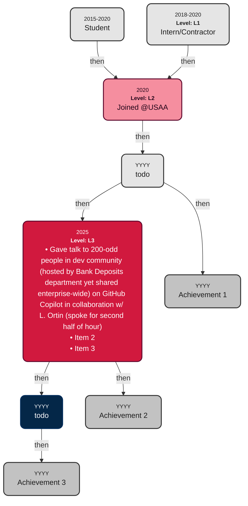

# Welcome! My name is S. Sepanski

Career contributions over time (WIP):

## Color Key for Nodes

Todo

## Label Key for Relationships

- **then**: Indicates the passage of time between events.
- **unlabeled**: This connection is either invalid or in draft status.

## Key for Node Content

- **@**: Indicates having joined or completed work associated with a particular company or organization.
- **Level**: Software engineer level, normalized to L1-L10, as described by [this LinkedIn post](https://www.linkedin.com/pulse/understanding-software-engineer-levels-from-entry-level-senior-pke9c/) (L1-L5) and [levels.fyi](https://www.levels.fyi/blog/swe-level-framework.html) (L6-L10)

## About Node Content

- **Dates**:
  - Formats like **YYYY** indicate that the node transpired for an unspecified duration in the given calendar year
  - Formats like **YYYY-YYYY** indicate that the node transpired for an unspecified duration within the given year range

# Coding Standards for This Project

- This project aims to follow [semantic commit messages](https://gist.github.com/joshbuchea/6f47e86d2510bce28f8e7f42ae84c716), electing to make the following modifications:
  - Substitute the word `task:` for `chore:` because it has a slightly more positive connotation.
  - Add a new category:
    - `wip`: (work in progress, a commit that really should be squashed. Most likely made to save changes because I had to go afk due to some happenstance of life)
