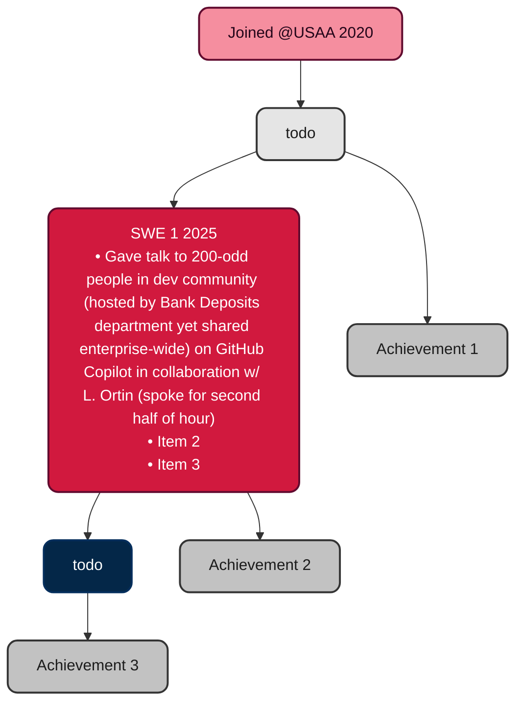

# Welcome! My name is S. Sepanski

Career contributions over time (WIP):

```mermaid
graph TD
    A[Joined @USAA 2020] --> B[todo]
    B --> C["SWE 1 2025<br>• Gave talk to 200-odd people in dev community (hosted by Bank Deposits department yet shared enterprise-wide) on GitHub Copilot in collaboration w/ L. Ortin (spoke for second half of hour)<br>• Item 2<br>• Item 3"]
    C --> D[todo]
    B --> E[Achievement 1]
    C --> F[Achievement 2]
    D --> G[Achievement 3]
    style A fill:#f58e9f,stroke:#610b2f,stroke-width:2px,color:#230519
    style B fill:#e5e5e5,stroke:#343434,stroke-width:2px,color:#1c1c1c
    style C fill:#d1193e,stroke:#610b2f,stroke-width:2px,color:#FFFFFF
    style D fill:#042748,stroke:#042e5c,stroke-width:2px,color:#FFFFFF
    style E fill:#c2c2c2,stroke:#343434,stroke-width:2px,color:#1c1c1c
    style F fill:#c2c2c2,stroke:#343434,stroke-width:2px,color:#1c1c1c
    style G fill:#c2c2c2,stroke:#343434,stroke-width:2px,color:#1c1c1c
    classDef rounded stroke-width:2px,rx:10,ry:10;
    class A,B,C,D,E,F,G rounded;
```
