# Welcome! My name is S. Sepanski

Career contributions over time (WIP):

## Color Key for Nodes

- <span style="color:#f58e9f;">&#9632;</span> Move - Indicates a horizontal or vertical move. Fill: #f58e9f. Stroke: #610b2f.
- <span style="color:#d1193e;">&#9632;</span> Creation - A delivered piece of value or work. Fill: #d1193e. Stroke: #610b2f.
- <span style="color:#042748;">&#9632;</span> Chat - A chat or talk delivered to some group of people. Fill: #042748. Stroke: #042e5c.
- <span style="color:#c2c2c2;">&#9632;</span> Recognition - A recognition, award, or honor offered by some external person or entity. <i>Agradecida que soy por esas cosas, cuando pasen (igual sigo adelante)</i>. Fill: #c2c2c2. Stroke: #343434.
- <span style="color:#7c7484;">&#9632;</span> Committee - Activity related to some committee, board, team, or task force. Fill: #7c7484. Stroke: #2e092d. <span style="color:#FFFFFF; background:#7c7484; padding:2px 6px; border-radius:3px;">Text: #FFFFFF</span>
- <span style="color:#5e4b8b;">&#9632;</span> Credential - A certification, degree, or formal credential earned. Fill: #5e4b8b. Stroke: #2e092d. <span style="color:#FFFFFF; background:#5e4b8b; padding:2px 6px; border-radius:3px;">Text: #FFFFFF</span>

## Label Key for Relationships

- **then**: Indicates the passage of time between events.
- **unlabeled**: This connection is either invalid or in draft status.

## Key for Node Content

- **@**: Indicates having joined or completed work associated with a particular company or organization.
- **#**: Indicates a skill or technology of interest. Use dashes where spaces would go. TODO
- **Level**: Software engineer level, normalized to L1-L10, as described by [this LinkedIn post](https://www.linkedin.com/pulse/understanding-software-engineer-levels-from-entry-level-senior-pke9c/) (L1-L5) and [levels.fyi](https://www.levels.fyi/blog/swe-level-framework.html) (L6-L10). Style as bold.
- **Impact**: Impact or reach of specified effort.
  - Enterprise-wide: impactful across companies in the enterprise
  - Company-wide: impactful across multiple departments in the company
  - Department-wide: impactful across a department in the company
  - Product-wide: impactful across entire application or across all teams in project
  - Team-wide: impactful across development team

## About Node Content

- **Dates**:
  - Formats like **YYYY** indicate that the node transpired for an unspecified duration in the given calendar year
  - Formats like **YYYY to YYYY** indicate that the node transpired for an unspecified duration within the given year range
  - Formats like **YYYY-MM** indicate that the node transpired for an unspecified duration in the given month
  - Formats like **YYYY-MM to YYYY-MM** indicate that the node transpired for an unspecified duration within the given month range
  - Formats like **YYYY-MM to today** indicate that the node began in the specified month and is ongoing

```mermaid
graph BT
    PreStudentNode["<div style='font-size:75%;  color:#848484; text-align:center;'>2015 to 2020</div>Student"] -->|then| A["<div style='font-size:75%; color:#848484; text-align:center;'>2020</div><div style='font-size:75%; color:#848484; text-align:center;'><b>Level: L2</b><br/></div>Joined @USAA<br>"]
    ContractorNode["<div style='font-size:75%; color:#848484; text-align:center;'>2019 to 2020</div><div style='font-size:75%; color:#848484; text-align:center;'><b>Level: L1</b></div>Contractor"] -->|then| A
    A -->|then| Credential1["<div style='font-size:75%; color:#848484; text-align:center;'>2022</div><div style='font-size:75%; color:#848484; text-align:center;'><b>Level: L2</b></div>Earned Certified AWS Developer - Associate certificate<br/><div style='font-size:75%; color:#848484; text-align:center;'>#AWS</div>"]
    Credential1 -->|then| Creation1["<div style='font-size:75%; color:#848484; text-align:center;'>2023</div><div style='font-size:75%; color:#848484; text-align:center;'><b>Level: L2</b><br/></div>Created migration guide for single-table design for DynamoDB<br/><b>Impact: </b>Product-wide<div style='font-size:75%; color:#848484; text-align:center;'>#DynamoDB<br/></div>"]
    Creation1 -->|then| Chat["<div style='font-size:75%; color:#848484; text-align:center;'>2023</div><div style='font-size:75%; color:#848484; text-align:center;'><b>Level: L2</b><br/></div>Gave talk to 50-odd people in technical community on DynamoDB Schema Design<br/><b>Impact: </b>Enterprise-wide<div style='font-size:75%; color:#848484; text-align:center;'>#DynamoDB #Single-Table-Design<br/></div>"]
    Chat -->|then| Creation2["<div style='font-size:75%; color:#848484; text-align:center;'>2023</div><div style='font-size:75%; color:#848484; text-align:center;'><b>Level: L2</b><br/></div>Created internal wikis to document practices for DynamoDB, API Gateway, and KMS<br/><b>Impact: </b>Project-wide<div style='font-size:75%; color:#848484; text-align:center;'>#DynamoDB #Serverless #AWS<br/></div>"]
    Creation2 -->|then| B["<div style='font-size:75%; color:#848484; text-align:center;'>2025-01 to today</div><div style='font-size:75%; color:#848484; text-align:center;'><b>Level: L3</b><br/></div>Joined Bank Cloud Enablement team<br/><b>Impact: </b>Company-wide"]
    B -->|then| CommitteeNode["<div style='font-size:75%; color:#848484; text-align:center;'>2024</div><div style='font-size:75%; color:#848484; text-align:center;'><b>Committee</b></div>100% Rollout of new open account flow across all members<br/><b>Impact: </b>Enterprise-wide"]
    CommitteeNode -->|then| Creation2
    B -->|then| C["<div style='font-size:75%; color:#848484; text-align:center;'>2025</div><div style='font-size:75%; color:#848484; text-align:center;'><b>Level: L3</b><br/></div>Gave talk to 200-odd people in dev community (hosted by Bank Deposits department yet shared enterprise-wide) on GitHub Copilot in collaboration w/ L. Ortin (spoke for second half of hour)<br/><b>Impact: </b>Enterprise-wide<div style='font-size:75%; color:#848484; text-align:center;'>#GitHub-Copilot<br/></div>"]
    C -->|then| CreationPromptLib["<div style='font-size:75%; color:#848484; text-align:center;'>2025</div><div style='font-size:75%; color:#848484; text-align:center;'><b>Level: L3</b><br/></div>Configured prompt library for app teams<br/><b>Impact: </b>Company-wide<div style='font-size:75%; color:#848484; text-align:center;'>#GitHub-Copilot #Amazon-Bedrock<br/></div>"]
    C -->|then| D["<div style='font-size:75%; color:#848484; text-align:center;'>2025</div><div style='font-size:75%; color:#848484; text-align:center;'><b>Level: L3</b><br/></div>Recorded and shared 15-minute demo showing potential of RAG with prompt libraries for improved development speed<br/><b>Impact: </b>Enterprise-wide<div style='font-size:75%; color:#848484; text-align:center;'>#GitHub-Copilot #RAG #Prompt-Engineering<br/></div>"]
    C -->|then| CreationDesign["<div style='font-size:75%; color:#848484; text-align:center;'>2025</div><div style='font-size:75%; color:#848484; text-align:center;'><b>Level: L3</b><br/></div>Created and documented design processes and standards for DynamoDB<br/><b>Impact: </b>Company-wide<div style='font-size:75%; color:#848484; text-align:center;'>#DynamoDB #Design-Standards<br/></div>"]
    CreationDesign -->|then| Chat2["<div style='font-size:75%; color:#848484; text-align:center;'>2025</div><div style='font-size:75%; color:#848484; text-align:center;'><b>Level: L3</b><br/></div>Recorded and shared 15-minute demo on standards for teams documenting DynamoDB queries<br/><b>Impact: </b>Company-wide<div style='font-size:75%; color:#848484; text-align:center;'>#DynamoDB #Dynamo-API<br/></div>"]
    B -->|then| E["<div style='font-size:75%; color:#848484; text-align:center;'>2025</div><div style='font-size:75%; color:#848484; text-align:center;'><b>Level: L3</b><br/></div>All Star award @USAA<br/><b>Impact: </b>Company-wide<div style='font-size:75%; color:#848484; text-align:center;'>#GitHub-Copilot #RAG<br/></div>"]
    C -->|then| F["<div style='font-size:75%; color:#848484; text-align:center;'>2025-04 to today</div><div style='font-size:75%; color:#848484; text-align:center;'><b>Level: L3</b><br/></div>Joined review board for DynamoDB & Aurora schemas<br/><b>Impact: </b>Company-wide<div style='font-size:75%; color:#848484; text-align:center;'>#DynamoDB #NoSQL-Workbench<br/></div>"]
    D -->|then| G["<div style='font-size:75%; color:#848484; text-align:center;'>2025</div><div style='font-size:75%; color:#848484; text-align:center;'><b>Level: L3</b><br/></div>Documented standards for Copilot custom instruction files<br/><b>Impact: </b>Company-wide<div style='font-size:75%; color:#848484; text-align:center;'>#GitHub-Copilot #RAG<br/></div>"]
    style PreStudentNode fill:#f58e9f,stroke:#610b2f,stroke-width:2px,color:#1c1c1c
    style ContractorNode fill:#f58e9f,stroke:#610b2f,stroke-width:2px,color:#1c1c1c
    style A fill:#f58e9f,stroke:#610b2f,stroke-width:2px,color:#230519
    style Credential1 fill:#5e4b8b,stroke:#2e092d,stroke-width:2px,color:#FFFFFF
    style Creation1 fill:#d1193e,stroke:#610b2f,stroke-width:2px,color:#FFFFFF
    style Chat fill:#042748,stroke:#042e5c,stroke-width:2px,color:#FFFFFF
    style Creation2 fill:#d1193e,stroke:#610b2f,stroke-width:2px,color:#FFFFFF
    style B fill:#f58e9f,stroke:#610b2f,stroke-width:2px,color:#1c1c1c
    style C fill:#042748,stroke:#042e5c,stroke-width:2px,color:#FFFFFF
    style D fill:#042748,stroke:#042e5c,stroke-width:2px,color:#FFFFFF
    style E fill:#e5e5e5,stroke:#343434,stroke-width:2px,color:#1c1c1c
    style F fill:#7c7484,stroke:#2e092d,stroke-width:2px,color:#FFFFFF
    style G fill:#d1193e,stroke:#610b2f,stroke-width:2px,color:#FFFFFF
    style Chat2 fill:#042748,stroke:#042e5c,stroke-width:2px,color:#FFFFFF
    style CreationPromptLib fill:#d1193e,stroke:#610b2f,stroke-width:2px,color:#FFFFFF
    style CreationDesign fill:#d1193e,stroke:#610b2f,stroke-width:2px,color:#FFFFFF
    style CommitteeNode fill:#343c54,stroke:#042748,stroke-width:2px,color:#FFFFFF
    classDef rounded stroke-width:2px,rx:10,ry:10;
    class PreStudentNode,ContractorNode,A,Credential1,Creation1,Chat,Creation2,B,C,D,E,F,G,Chat2,CreationPromptLib,CreationDesign,CommitteeNode rounded;
```mermaid.flowchart

```


```mermaid.flowchart

```mermaid.flowchart
```

# Coding Standards for This Project

- [Standards for commit messages](https://gist.github.com/s-sepanski/44b111869e0be434ea3d1a2335b9db68)
