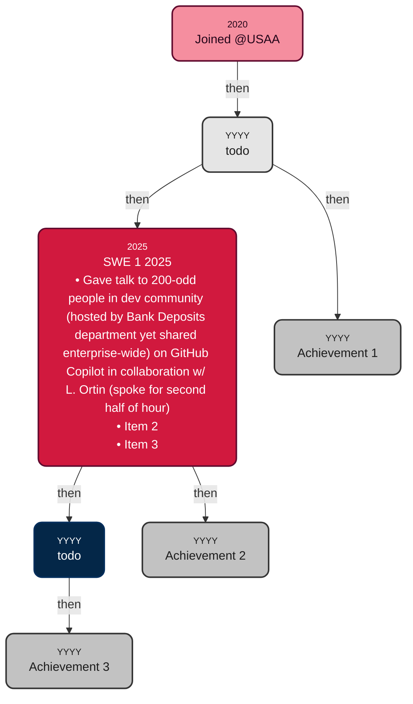

# Welcome! My name is S. Sepanski

Career contributions over time (WIP):
## Color Key for Nodes

Todo

## Label Key for Relationships

- **then**: Indicates the passage of time between events.
- **unlabeled**: This connection is either invalid or in draft status.

## Key for Node Content

- **@**: Indicates having joined or completed work associated with a particular company or organization.

## About Node Content
- **Dates**:
  - Formats like **YYYY** indicate that the node transpired for an unspecified duration in the given calendar year 

